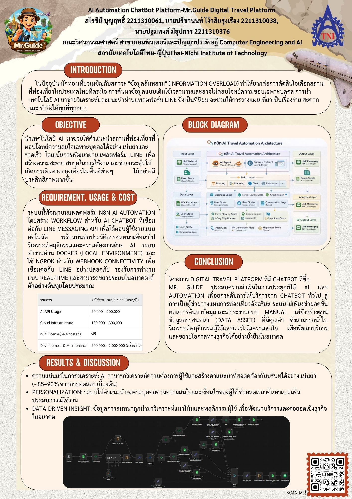

# Mr.Guide: AI-Powered Travel Recommendation Platform

**Mr.Guide** is an intelligent travel recommendation platform designed to address the problem of **information overload** in tourism planning. The system leverages Artificial Intelligence and workflow automation to analyze user preferences and provide personalized travel recommendations through the LINE Messaging Platform.

---

## 🌟 Features

### Personalized Recommendations

* Analyze user preferences and travel interests using AI.
* Provide personalized destination recommendations with an estimated recommendation accuracy of **85–90%**.

### Real-Time Automation

* Fully automated workflows powered by **n8n**.
* Minimize manual operations and improve response efficiency.

### Seamless LINE Integration

* Connect directly with the **LINE Messaging API**.
* Enable users to interact with the chatbot through a familiar messaging platform.

### Data-Driven Insights

* Store conversation history and user interactions.
* Support future recommendation improvements through behavioral analysis.

---

## 🏗️ System Architecture

The system is designed using a layered architecture:

### Input Layer

* Receive user messages through LINE Webhooks.

### AI Agent Layer

* Process user requests using **Google Gemini**.
* Perform intent recognition and recommendation generation.

### Data Layer

* Store user and destination data using:

  * Google Sheets
  * PDI Database

### Business Logic Layer

* Manage workflows for:

  * Travel planning
  * Booking processes
  * Chatbot interactions

### Analytics Layer

* Track key metrics such as:

  * Conversion Flags
  * Happiness Scores
  * Conversation Logs



---

## 🛠️ Technology Stack

### Automation & Workflow

* **n8n** – Workflow automation platform

### Artificial Intelligence

* **Google Gemini AI** – Large Language Model (LLM) for natural language understanding and recommendation generation

### Infrastructure & Deployment

* **Docker**
* **Docker Compose**
* **Ngrok**

### External Services

* **LINE Messaging API**
* **Google Sheets**

---

## 🚀 Getting Started

### Prerequisites

* Docker
* Docker Compose
* LINE Developers Account
* Gemini API Key

### Installation

#### 1. Clone the Repository

```bash id="j3t45w"
git clone https://github.com/Gnuriass/n8n-project.git
cd n8n-project
```

#### 2. Create Required Directories

Before starting the system, create the following folders inside the project directory:

```text id="1h7j4d"
n8n_data/
files/
```

Purpose:

* `n8n_data/`

  * Stores n8n configuration files and workflow data.

* `files/`

  * Stores uploaded and generated files used by the system.

#### 3. Start the Application

Run Docker Compose in detached mode:

```bash id="ew4xvn"
docker compose up -d
```

#### 4. Access the Platform

Once all containers are running, open:

```text id="yx4a3i"
http://localhost:5678
```

Configure:

* LINE Messaging API credentials
* Gemini API Key
* Workflow settings

---

## 📊 Project Objectives

This project aims to:

* Apply Artificial Intelligence in tourism recommendation systems.
* Reduce information overload during travel planning.
* Develop practical workflow automation using n8n.
* Integrate multiple cloud services and APIs into a unified platform.
* Improve user experience through conversational AI.

---

## 🎓 Academic Context

This project was developed as part of coursework in the

**Computer Engineering and Artificial Intelligence Program (CE)**

at the Thai-Nichi Institute of Technology (TNI).

---
## 👤 Author
This repository is maintained by Sarochinee Bunyarit
 
---

# Mr.Guide: AI Automation ChatBot Platform for Digital Travel

**Mr.Guide** เป็นแพลตฟอร์มแนะนำการท่องเที่ยวอัจฉริยะที่พัฒนาขึ้นเพื่อแก้ปัญหา "สภาวะข้อมูลล้นหลาม" (Information Overload) โดยการใช้ AI และ Automation เข้ามาช่วยวิเคราะห์และแนะนำสถานที่ท่องเที่ยวที่ตอบโจทย์ความสนใจเฉพาะบุคคลผ่านแอปพลิเคชัน LINE

## 🌟 Features
- **Personalized Recommendation:** วิเคราะห์ความต้องการผู้ใช้และแนะนำสถานที่ท่องเที่ยวได้แม่นยำ (ความแม่นยำ ~85-90%)
- **Real-time Automation:** ทำงานแบบอัตโนมัติผ่าน n8n Workflow
- **Seamless Integration:** เชื่อมต่อกับ LINE Messaging API สำหรับการโต้ตอบกับผู้ใช้
- **Data-Driven Insights:** บันทึกประวัติการสนทนาเพื่อนำมาวิเคราะห์พฤติกรรมและความต้องการในอนาคต

## 🏗️ System Architecture
ระบบถูกออกแบบโดยแบ่งเป็น Layer ต่างๆ ดังนี้:
- **Input Layer:** รับข้อมูลผ่าน LINE Webhook
- **AI Agent Layer:** ประมวลผลด้วย Gemini Model เพื่อวิเคราะห์เจตนา (Intent) ของผู้ใช้
- **Data Layer:** ใช้ Google Sheets และ PDI Database ในการจัดเก็บข้อมูลผู้ใช้และสถานที่
- **Business Logic Layer:** จัดการ Workflow การจอง (Booking), การวางแผน (Planning) และการแชท
- **Analytics Layer:** ติดตาม Conversion Flag, Happiness Score และบันทึก Logs การสนทนา
  

## 🛠️ Tech Stack
- **n8n:** ระบบหลักในการทำ Automation Workflow
- **Google Gemini AI:** สมองหลักในการวิเคราะห์และประมวลผลภาษา (LLM)
- **Docker:** ใช้สำหรับจำลองสภาพแวดล้อม (Local Environment) ในการรันระบบ
- **Ngrok:** สำหรับทำ Webhook Connectivity เชื่อมต่อกับ LINE API อย่างปลอดภัย
- **Line Messaging API:** ช่องทางหลักในการติดต่อกับผู้ใช้งาน
- **Google Sheets:** สำหรับจัดเก็บข้อมูลฐานข้อมูลเบื้องต้น

## 🚀 Getting Started

### Prerequisites
- [Docker](https://www.docker.com/) & [Docker Compose](https://docs.docker.com/compose/)
- บัญชี [LINE Developers](https://developers.line.biz/)
- [Gemini API Key](https://aistudio.google.com/)

### Installation
1. Clone repository นี้ลงเครื่อง:
   ```bash
   git clone [https://github.com/Gnuriass/n8n-project.git](https://github.com/Gnuriass/n8n-project.git)
   cd n8n-project
2. เตรียมโฟลเดอร์สำหรับเก็บข้อมูล (สำคัญ ⚠️)
เนื่องจากโฟลเดอร์เก็บข้อมูลถูกตั้งค่าข้ามการอัปโหลดไว้บน GitHub ก่อนรันระบบให้สร้างโฟลเดอร์เหล่านี้ในโฟลเดอร์โปรเจคก่อน:
- `n8n_data` (สำหรับเก็บฐานข้อมูลและคอนฟิกของ n8n)
- `files` (สำหรับเก็บไฟล์อัปโหลด/ดาวน์โหลดของระบบ)

3. รันระบบด้วย Docker Compose
ใช้คำสั่งนี้เพื่อสร้างและเริ่มทำงาน Container ทั้งหมดในโหมด Background (Detached Mode):
    ```bash
    docker compose up -d
4. เข้าใช้งานระบบ
เมื่อ Container เริ่มทำงานเรียบร้อยแล้ว คุณสามารถเข้าใช้งาน n8n ได้ที่:
👉 http://localhost:5678 เพื่อทำการตั้งค่า Workflow และเชื่อมต่อ API Keys ต่างๆ (เช่น LINE Messaging API และ Gemini API Key)
   
โครงการนี้เป็นส่วนหนึ่งของวิชาเรียน คณะวิศวกรรมศาสตร์ สาขาคอมพิวเตอร์และปัญญาประดิษฐ์ สถาบันเทคโนโลยีไทย-ญี่ปุ่น (TNI)
